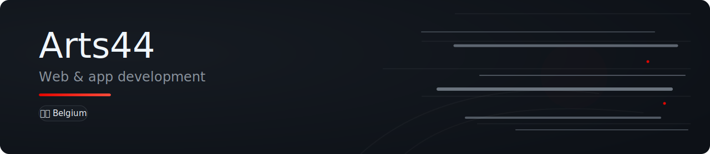

<div align="center">



<br/>


<br/>


<br/>

[](https://github.com/Arts44)
[](https://github.com/Arts44?tab=followers)

</div>

---

## Introduction

Je suis **Arthur Mestdagt** — étudiant à **HEC Liège**, développeur autodidacte, basé en Belgique.

J'aime construire des logiciels qui tiennent la route : rapides, lisibles, pensés pour durer. Mon approche ressemble un peu à l'ingénierie F1 — comprendre les contraintes, optimiser ce qui compte, livrer quelque chose de fiable plutôt que d'empiler des couches inutiles.

Quand je ne code pas, je suis les week-ends de course, j'expérimente avec l'IA comme outil de travail, je modde Minecraft ou je sors avec mon appareil photo.

---

## Compétences

<table>
<tr>
<td valign="top" width="50%">

**Développement**

- JavaScript vanilla (ES modules, IIFE bundles)
- HTML5, CSS3 — design tokens, thèmes clair/sombre
- Progressive Web Apps — service workers, manifests, offline-first
- Web platform APIs — Web Crypto, CompressionStream, fetch REST
- Node.js — tests (`node --test`), build (esbuild)
- Java — en cours (HEC Liège + modding Minecraft)
- Python — scripts et automatisation

</td>
<td valign="top" width="50%">

**Pratiques & domaines**

- Architecture sans dépendances runtime
- Internationalisation (7 langues sur mon projet phare)
- CI/CD — GitHub Actions, tests automatisés
- Supabase — auth OTP, RLS, REST pur (sans SDK)
- Sécurité de base — chiffrement at-rest, PIN, viewer mode
- UX soignée — tutoriels interactifs, accessibilité, `prefers-reduced-motion`

</td>
</tr>
</table>

---

## Outils

<div align="center">

### Environnement de développement


### IA & création


### Stack projet


</div>

---

## Projets

### F1 UNO Élite Tracker — projet phare

Application web progressive pour suivre une collection de cartes *F1 UNO Élite* : **101 cartes** de la saison 2025, chacune en **jusqu'à 16 variantes**, avec suivi owned/doubles/wishlist, système de rareté à 6 niveaux, badges, statistiques et tutoriel interactif.

**[Application live](https://arts44.github.io/f1-uno-elite/)** · **[Code source](https://github.com/Arts44/f1-uno-elite)**

<table>
<tr>
<td width="50%">

**Ce que j'ai construit**

- Vanilla JavaScript — **zéro dépendance runtime**
- PWA offline-first avec service worker versionné
- Sync cloud Supabase via REST pur — pas de SDK
- Auth OTP email (compatible PWA installée)
- Chiffrement optionnel PBKDF2 + AES-GCM (Web Crypto)
- **7 langues** — EN, FR, ES, ZH, IT, NL, DE
- **166 tests** automatisés, CI sur chaque push
- Export/import JSON, codes backup compressés, QR codes

</td>
<td width="50%">

**Pourquoi ce projet compte**

C'est mon laboratoire : j'y applique mes principes — stack minimal, tests avant le ship, i18n dès le départ, honnêteté sur les limites. Du rendu foil animé au feedback in-app via trigger Postgres, chaque feature a une raison d'être.

<sub>Projet fan non officiel, non commercial. Non affilié à Formula 1 ou Mattel/UNO.</sub>

</td>
</tr>
</table>

---

### Autres terrains d'exploration

Ces domaines ne sont pas (encore) des repos publics, mais ils font partie de ma pratique :

<table>
<tr>
<td width="33%">

**Minecraft**

Serveurs moddés, systèmes d'économie, environnements custom, optimisations techniques. Exploration de Java, Forge et administration serveur.

</td>
<td width="33%">

**IA & automatisation**

Utilisation de Claude, Claude Code, Cursor et ChatGPT pour accélérer la recherche, le design et le développement — toujours avec relecture et tests manuels.

</td>
<td width="33%">

**Photographie**

Canon EOS 70D — prise de vue RAW, retouche créative, composition. L'œil pour le détail se retrouve aussi dans mes interfaces.

</td>
</tr>
</table>

---

## Philosophie & workflow

```
Idée → Contraintes → Design → Code → Tests → Release
```

**Principes que j'applique :**

| | |
|---|---|
| **Stack lean** | Pas de framework ni SDK si les APIs web suffisent |
| **Offline d'abord** | Une app qui marche en avion vaut mieux qu'une demo en ligne |
| **Tests concrets** | 166 tests sur la logique métier — pas de couverture cosmétique |
| **i18n non négociable** | Une string en anglais seule = changement incomplet |
| **Honnêteté** | Documenter les limites (PIN, email test domain…) plutôt que les cacher |

L'IA fait partie de mon workflow, pas de mon identité : elle accélère la recherche et l'itération, mais le code qui ship reste le mien — relu, testé, assumé.

---

## Statistiques GitHub

<div align="center">


<br/><br/>

<picture>
  <source media="(prefers-color-scheme: dark)" srcset="./assets/github-contribution-grid-snake-dark.svg">
  <source media="(prefers-color-scheme: light)" srcset="./assets/github-contribution-grid-snake.svg">
  
</picture>

</div>

---

## Contact

<div align="center">

[](https://github.com/Arts44)

<br/>

*Merci de passer — n'hésite pas à explorer mes repos ou me contacter via GitHub.*

</div>
